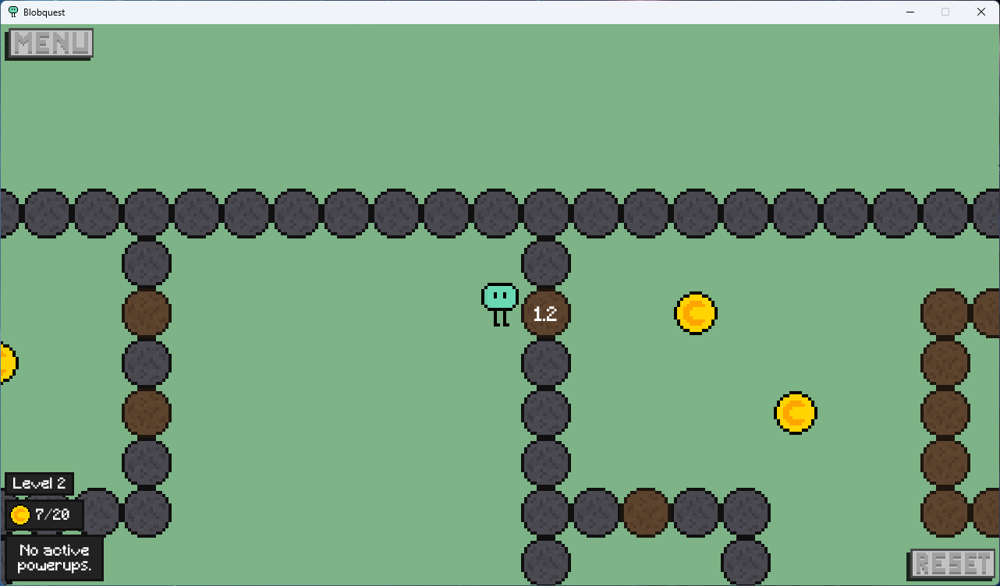
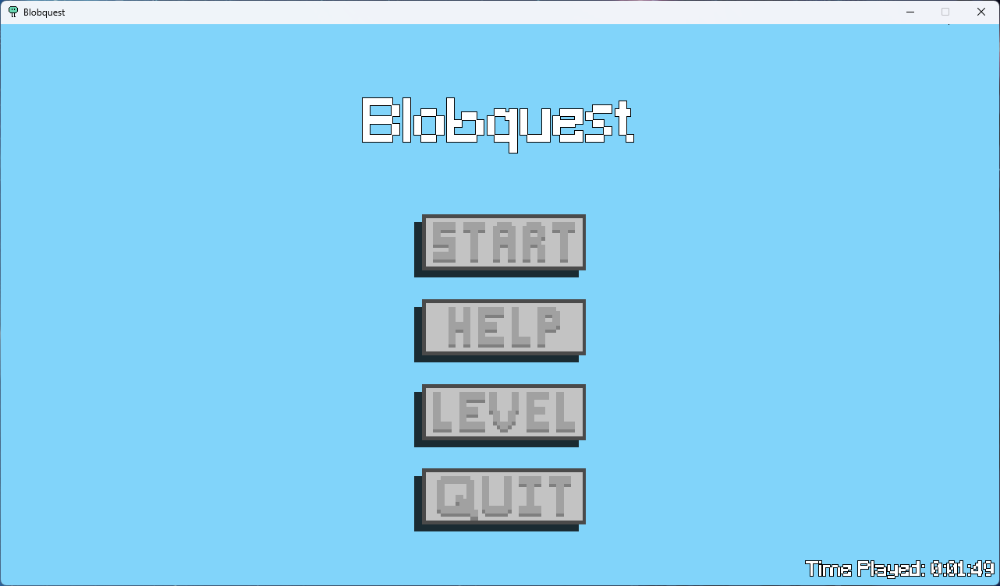
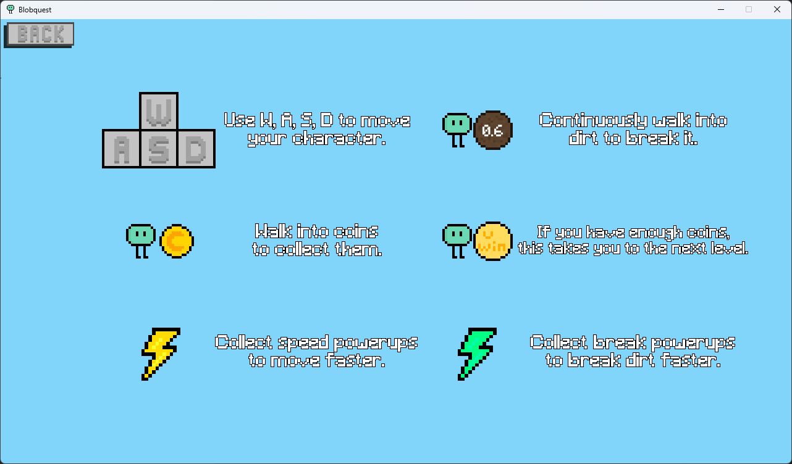
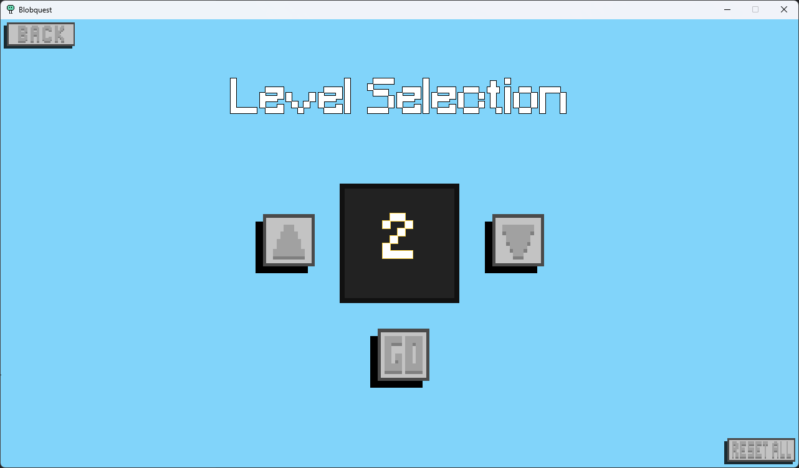
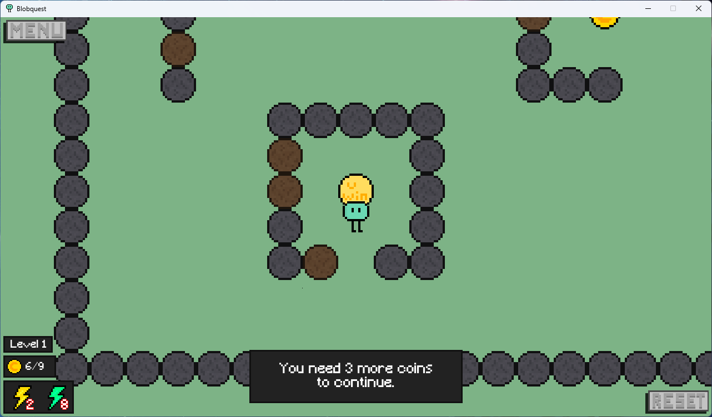

# Blobquest

A simple 2D game about a "blob" collecting coins, made with pygame.

## About
A small, three level game where you collect coins scattered around the level to progress.
It was created to learn Python & pygame, and since it was **finished around Dec 2022**, the code is pretty badly written.
I don't have any plans of redoing the python code to make it better, but I may rewrite the game in Rust eventually.

## Features
- Creates maps from PNG files, reading pixels as tiles
- Basic animation between levels, basic responsive UI
- Button implementation from scratch, with base, hover, and pressed assets
- Interactable tiles, like breakable dirt & level end tile
- 3 custom levels

## Making Maps
Making new maps is easy, as the game generates the level based on pixels in an image.
To make your own, create an image, using the following table of pixel colors to define the layout of the map.
Check [resources/maps](./resources/maps) for an example.

| Pixel Hex | Game Tile |
| ------------- | ------------- |
| #81b386  | Empty |
| #595959  | Rock |
| #7f3f0e  | Dirt |
| #4b826f  | Player |
| #d4af37  | Coin |
| #96ffdc  | Level End |
| #00cc8e  | Break Powerup |
| #ffefa3  | Speed Powerup |

Once you're done, move the image to [resources/maps](./resources/maps), and add an entry into [mapDictionary.py](./src/mapDictionary.py), with the file name as key and the coin requirement as a the value.
If you set the value to `True`, the game will calculate the requirement automatically.

## Screenshots

### Menu

### Help

### Level Selection

### Level 1

### Level 2

